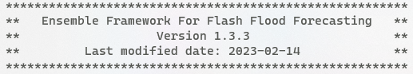

Ensemble Framework For Flash Flood Forecasting (EF5)
===




 [](https://travis-ci.org/HyDROSLab/EF5) 

EF5 was created by the Hydrometeorology and Remote Sensing Laboratory at the University of Oklahoma.
The goal of EF5 is to have a framework for distributed hydrologic modeling that is user friendly, adaptable, expandable, all while being suitable for large scale (e.g. continental scale) modeling of flash floods with rapid forecast updates. Currently EF5 incorporates 3 water balance models including the Sacramento Soil Moisture Accouning Model (SAC-SMA), Coupled Routing and Excess Storage (CREST), and hydrophobic (HP). These water balance models can be coupled with either linear reservoir or kinematic wave routing. 

## Features

- Distributed hydrological modeling
- Multiple water balance models (CREST, SAC, HP, HyMOD)
- Multiple routing schemes (Kinematic Wave, Linear Reservoir)
- Snow modeling capabilities
- Lake and reservoir modeling with calibration support
- Real-time forecasting capabilities
- Ensemble forecasting
- Data assimilation

## Lake Module

EF5 includes a comprehensive lake module that supports:

### Lake Features
- **Natural outflow modeling**: Storage-based overflow + linear reservoir decay
- **Engineered discharge**: Support for dam-controlled outflow
- **Water balance**: Precipitation, evaporation, and inflow integration
- **Unit conversion**: Automatic km³/km² to m³/m² conversion for user-friendly input
- **Multiple lakes**: Support for multiple lakes in a single simulation
- **State saving/loading**: Automatic saving and loading of lake storage and outflow states
- **Grid-based state management**: Distributed state management for large-scale simulations
- **Restart capability**: Resume simulations from any saved state point
- **Flexible configuration**: Define lakes in lakes.csv or individual [LAKE] sections

### Lake Calibration
The lake module integrates with EF5's DREAM calibration system:

- **klake parameter**: Linear reservoir retention constant (hours)
- **Automatic calibration**: DREAM algorithm optimizes lake parameters
- **Parameter ranges**: Configurable min/max/initial values
- **Objective functions**: All standard EF5 objective functions supported

### Configuration
```bash
# Enable lake module with state saving
[TASK MyTask]
LakeModule = true
State = ./states
StateTime = 20240101_00
SaveStates = true

# Method 1: Define lakes in lakes.csv (recommended for multiple lakes)
[BASIN MyBasin]
LakeListFile = lakes.csv

# Method 2: Define lakes individually in control file
[LAKE Reservoir1]
Lat = 35.5
Lon = -97.8
Area = 0.1         ; km² (converted to m² internally)
ThVolume = 0.5    ; km³ (converted to m³ internally)
Klake = 24.0      ; hours

# Optional engineered discharge file
LAKEOUTFLOWFILE "engineered_discharge.csv"

# Lake calibration parameters
[LAKE_CALI_PARAM lake_cali_example]
LakeName = Lake1
klake = 1.0,100.0  ; min,max values (initial values come from lakes.csv)
```

### State Files
Lake state files are automatically saved as TIF grids:
- `lake_storage_YYYYMMDD_HHUU.tif` - Lake storage state
- `lake_outflow_YYYYMMDD_HHUU.tif` - Lake outflow state

See `LAKE_INTEGRATION_README.md` for detailed documentation.

## Learn More

EF5 has a homepage at [http://ef5.ou.edu](http://ef5.ou.edu). The training modules are found at [http://ef5.ou.edu/training/](http://ef5.ou.edu/training/) while the YouTube videos may be found at [https://www.youtube.com/channel/UCgoGJtdeqHgwoYIRhkgMwog](https://www.youtube.com/channel/UCgoGJtdeqHgwoYIRhkgMwog). The source code is found on GitHub at [https://github.com/HyDROSLab/EF5](https://github.com/HyDROSLab/EF5).

See [manual.html](https://chrimerss.github.io/EF5/docs/) for the EF5 operating manual which describes configuration options.

## Compiling

### Linux

Clone the source code from GitHub.   
1. autoreconf --force --install   
2. ./configure   
3. make   
   This compiles the EF5 application!

### OS X

Clone the source code from GitHub. Use the EF5 Xcode project found in the EF5 folder and compile the project.

### Windows

Currently cross-compiling from Linux is the recommended way of generating Windows binaries.

Clone the source code from GitHub.

1. autoreconf --force --install
2. For 32-bit Windows installations use ./configure --host=i686-w64-mingw32   
   For 64-bit Windows installations use ./configure --host=x86_64-w64-mingw32

3. make   
   This compiles the EF5 application!

## Contributors

The following people are acknowledged for their contributions to the creation of EF5.

Zac Flamig

Humberto Vergara

Race Clark

JJ Gourley

Yang Hong

Zhi Li

Mengye Chen

## Lake Module Integration

The EF5 v4.0 includes an integrated lake module that can be controlled via the `LakeModule` flag in the task configuration.

### Lake Module Control

The lake module is controlled by the `LakeModule` parameter in the task section:

```
LakeModule=true|false
```

**Validation Rules:**
- When `LakeModule=true`:
  - Either `lakes_csv` (CSV file) OR `lake` references (LakeConfigSection) is **required**
  - `LakeCaliParam` is **required** for calibration runs (`STYLE=cali_dream`)
  - `engineered_discharge_csv` is **optional**
- When `LakeModule=false`:
  - All lake-related parameters are **forbidden**
  - Lake processing is completely disabled

### Lake Configuration Methods

#### Method 1: CSV File Reading (Recommended for multiple lakes)
```
LakeModule=true
lakes_csv=lakes.csv
engineered_discharge_csv=engineered_discharge.csv  # Optional
LakeCaliParam=default_lake_cali_params  # Required for calibration
```

#### Method 2: Individual Lake Sections (Recommended for single lakes)
```
LakeModule=true
LakeCaliParam=default_lake_cali_params  # Required for calibration

[LAKE Reservoir1]
Lat = 35.5
Lon = -97.8
Area = 0.1         ; km² (converted to m² internally)
ThVolume = 0.5    ; km³ (converted to m³ internally)
Klake = 24.0      ; hours

[BASIN MyBasin]
lake = Reservoir1  ; Reference the lake defined above
```

### Validation and Error Messages

The system will validate lake module configuration and provide clear error messages:

**Common Error Scenarios:**
- `LakeModule is enabled but neither lake parameter set nor lakes CSV is provided`
- `LakeModule is enabled for calibration but lake calibration parameter set is not specified`
- `Lake parameter set is specified but LakeModule is disabled`
- `Lake calibration parameter set is specified but LakeModule is disabled`
- `Lake model is specified but LakeModule is disabled`

### CSV File Formats
